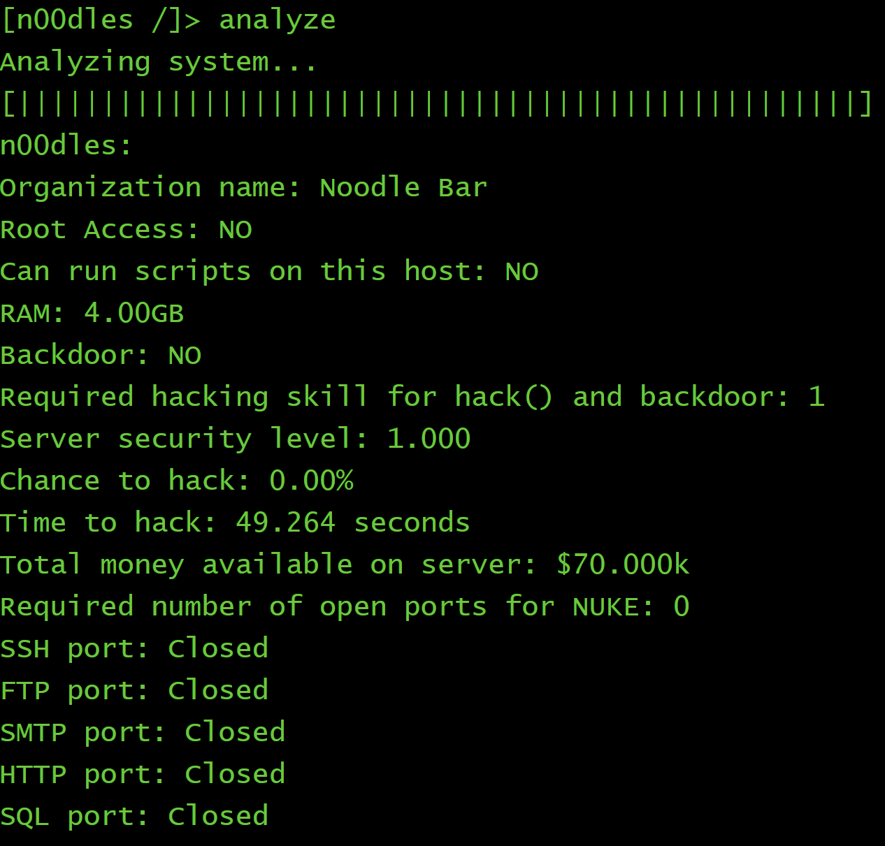

安利一个游戏！

这个游戏叫Bitburner，背景是在2077年，货币已经去中心化，你是一名黑客，你的目标就是黑别人的电脑偷钱。

游戏界面大概长这样：


游玩方式稍微有点硬核。

需要通过在游戏内的终端输入命令来进行。

输入`help`命令可以查看所有指令。

输入命令`scan`可以看到和当前机器相连的主机


使用`connect`指令可以连接到一个主机


接下来输入`analyze`可以分析这个主机



可以看到这是一家拉面店，由于Required number of open ports for NUKE: 0所以我们可以直接用nuke.exe来获得这个拉面店的所有权限。


可以看到获取root权限成功了，接下来使用`hack`命令就可以获得金钱


黑入成功！获得了288刀乐和3.3的黑客经验，但是安全等级提升了0.002，随着安全等级的提升，你黑入获得的金钱就会减少。

使用`grow`命令可以提升当前主机的可用资金


可用资金大概提升了12倍，但是安全等级也提高了0.1

接下来就该`weaken`出场了！


可以看到，使用`weaken`命令可以降低安全等级。

至此，我们已经完成了一次简单的骇入并获得金钱了，但是总是这样敲代码不会累么...

没关系！我们可以通过编写脚本来自动完成这些操作！

游戏中使用的编程语言叫做NetScript，分为NS1和NS2两种版本。NS1是JavaScript的一个子集，在游戏中运行速度较慢。NS2则是几乎涵盖了所有JavaScript的功能，运行速度飞快。NS1代码的（游戏中的）扩展名为.script。NS2代码的扩展名为.js。 详细内容点击[这里](https://bitburner.readthedocs.io)。

回到游戏，我们在终端使用`nano hack.script` 这个命令来打开文本编辑器

然后编写NS1格式的脚本文件：

```javascript
while(true)
hack("n00dles")
```

解释：while(true)就是一个死循环，会让hack("n00dles")这个指令一直执行。

按ctrl+s保存和ctrl+b关闭文本编辑器返回终端界面。

然后键入`run hack.script`来运行这个脚本


可以看到我们创建了一个进程。然后点击左侧的Active Script可以看到当前正在运行的脚本。

类似地，我们还可以实现`grow`操作和`weaken`操作

然而呢，运行脚本会占用内存，我们的本地主机只有8GB内存，而上面一个脚本就占用了1.75GB的内存了，再多运行几个脚本的话内存就会耗尽。为了解决内存问题，我们可以去电脑城买更大的内存条，或者干脆购买云端服务器。在我们的出生城市Sector-12有一个电脑配件商城叫alpha ent.


可是点进这个商城以后我才发现，把我们的本地主机的内存从8GB升级到16GB需要一百多万美元，吐血。。。

看来我们需要转换一个思路，既然我们已经取得了远程主机的root权限，那我们为什么不把脚本直接在想要黑入的服务器上运行呢？

我们来编写一个能将我们的三件套复制到远程主机上的脚本：

```javascript
var from = "home";
var to = args[0];

scp("hack.script",from,to)
scp("grow.script",from,to)
scp("weaken.script",from,to)
```

scp()函数可以实现拷贝功能。这里当我们在终端运行脚本时可以向其传递参数，传递的参数可以用args访问。

当我们在终端中输入 run copy.script foodnstuff 之后就可以在foodnstuff中看到这三个文件了。
