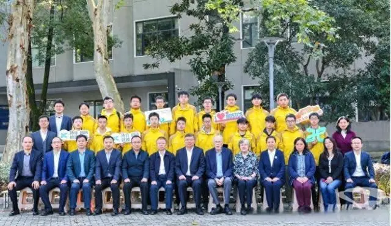
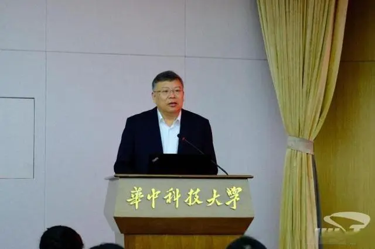
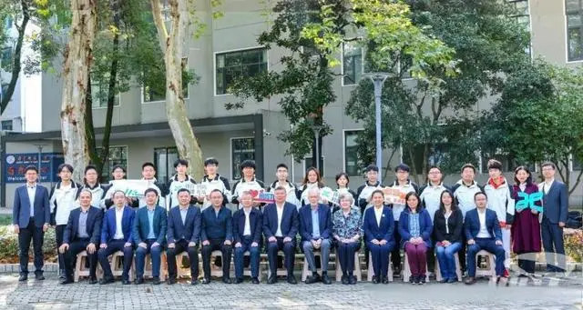
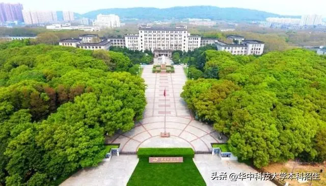

[原文链接](https://baijiahao.baidu.com/s?id=1782508986652922058)

近日，华中科技大学计算机科学与技术学院图灵实验班开班仪式正式举行。中国工程院院士、华科大校长尤政，中国科学院外籍院士、图灵奖得主、美国康奈尔大学John Hopcroft教授参加开班仪式并致辞。

尤政校长指出，华中科技大学始终坚持把立德树人作为根本任务，作为首批入选基础学科拔尖计划2.0基地的单位，十多年来，计算机科学与技术学院坚持落实国家和学校战略部署，在计算机学科拔尖人才培养方面取得了显著的成效。

图灵实验班是学校在计算机学科拔尖人才培养的又一次全新的探索。希望在John Hopcroft教授支持下，图灵班在不久的将来发挥出积极示范作用，图灵班的学子能够在华科大创新创造的沃土中，顶天立地，追求卓越，早日成长为担当重任的计算机学科优秀创新人才，为实现高水平科技自立自强贡献华科大智慧和力量。

John Hopcroft表示非常荣幸能够参与华中科技大学计算机学科拔尖人才培养。华中科技大学是一所持续培养一流人才的一流高校，未来他将积极汇聚全球最优秀的教师指导和培养图灵班的学生。

计算机学院院长冯丹教授代表计算机学院汇报了计算机学院拔尖创新人才培养的成果和计划。

图灵班班主任何强在发言中表示，将一直陪伴同学们前行，共同创造美好的学术和科研之旅。

学生代表、2022级本科生赖禹欣在发言中用四个“我期待着”表达了对未来与学术大师、顶尖学者、优秀同辈一起学习探索的向往。

开班仪式上，尤政校长、John Hopcroft共同为图灵班授旗。

拔尖创新人才是推动科技创新、引领产业革新的核心要素，是人才资源中最关键、最稀缺的顶尖部分。

一直以来，华中科技大学始终坚持以“一流大学、一流本科”为建设目标，践行“以学生为中心的教育”理念，按照“科学教育与人文素质教育相融合”的教育思想，在拔尖创新人才培养上持续发力，致力于造就具有国际竞争力的高素质的创造性人才。

华科大立足自身实际，勇担育人使命。学校把最好的资源、最多的温暖、最深的情感倾注到学生身上，最大程度地激发学生的内在潜能，让每一名华科大学子志存高远、博学善思、务实奉献，成为更好的自己，用青春的能动力和创造力激荡起民族复兴的澎湃浪潮。

培养拔尖人才的使命在前，重任在肩。面向未来，华中科技大学将继续在拔尖人才培养特色班这块高等教育“试验田”上勤耕细作，不断探索人才培养的创新路径，为建设人才强国汇聚磅礴力量！

欢迎关注“华中科技大学本科招生”头条号，获取关于985、211、“双一流”建设高校——华中科技大学的最新精彩资讯！

部分素材来源：华中科技大学官网/官微、华中科技大学招生办公室等