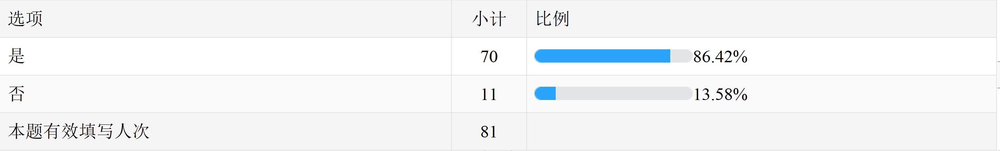
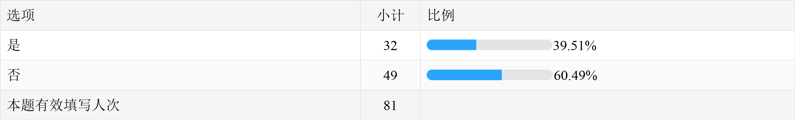
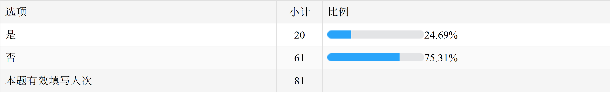
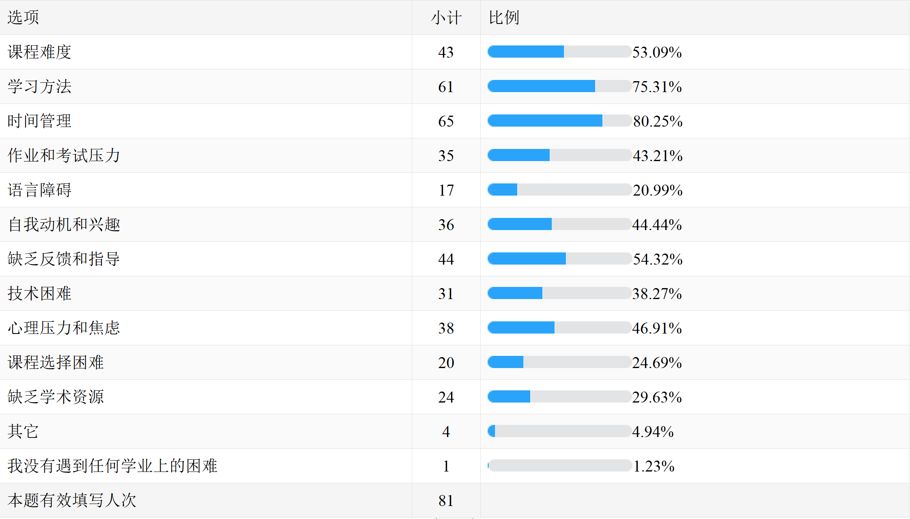
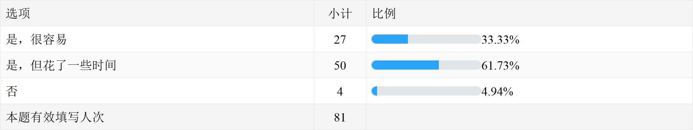
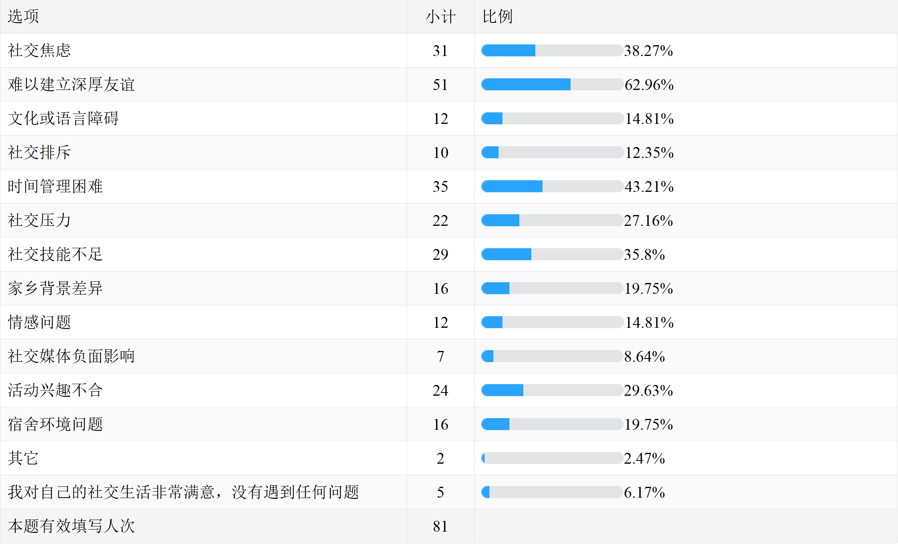
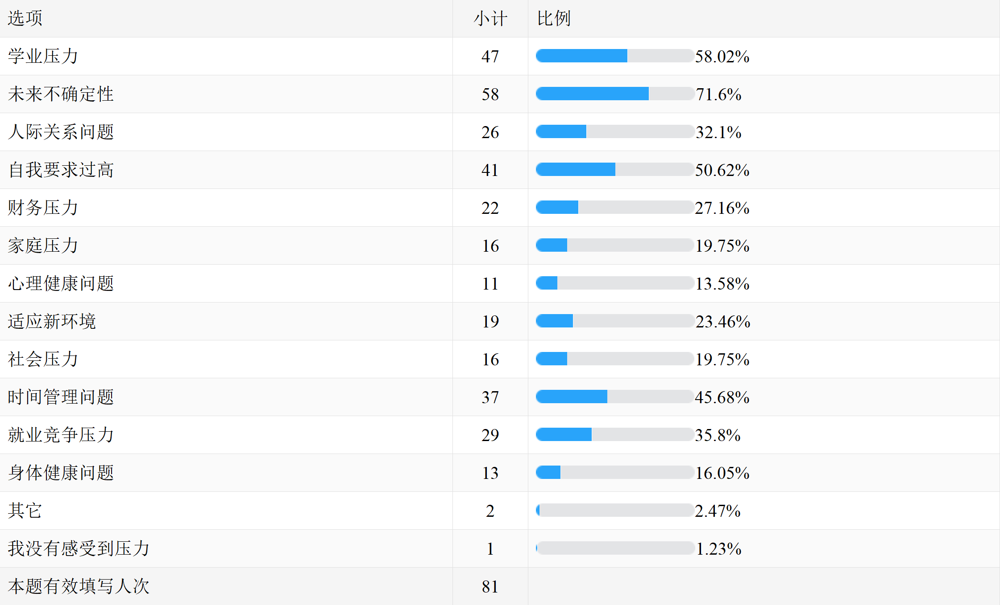
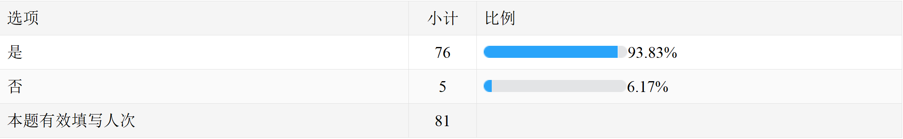
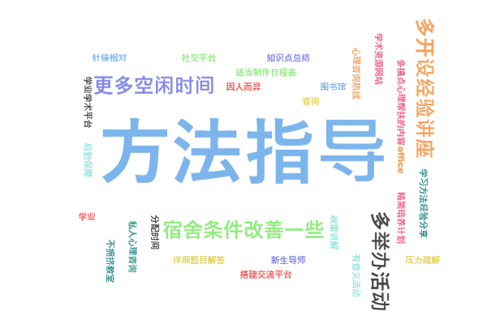

第1题   你是否是2023年入学的大学新生？      [单选题]

第2题   你的专业是？      [填空题]

第3题   在入学前，你是否参加过大学迎新活动或者预备课程？      [单选题]

第4题   你觉得自己在高中时期是否得到了足够的大学准备？      [单选题]

第5题   你在大学中遇到了哪些学业上的困难？      [多选题]

第6题   你在大学里交到了新朋友吗？      [单选题]

第7题   你在大学的社交生活中遇到了哪些困难？      [多选题]

第8题   你在大学生活中感受到了哪些方面的心理压力？      [多选题]

第9题  你是否知道学校提供心理健康支持服务？    [单选题]

第10题  你对大学生活的未来有什么期望？    [填空题]

第11题  你认为大学应该为新生提供哪些支持和资源，以帮助他们克服困难？    [填空题]

第12题  你有什么其他关于大学新生面临困难的想法、建议或者经历想要分享的吗？    [填空题]

